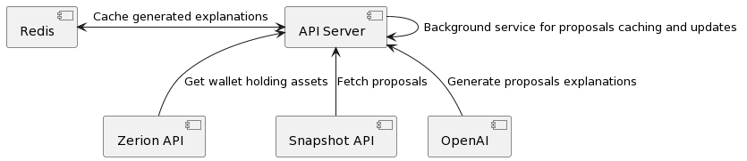

# Holdim.to - API Server

API Server is implemented using TypeScript + NodeJS + Express.
Redis is used for caching.

Portfolio API for mobile application is implemented by fetching the user wallet's holdings of DAO governance tokens from Zerion API.

Feed API for mobile application is implemented by fetching and sorting all the proposals from Snapshot API.

AI-generated explanations for proposals are being pre-processed, fetched from OpenAI API, post-processed and cached.

Additional Scrapper Service is running in the background and periodically generating explanations for new proposals.